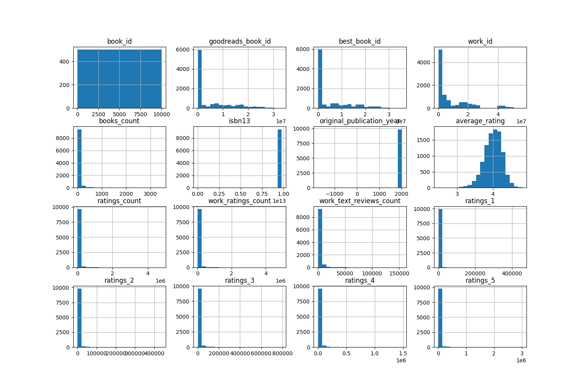
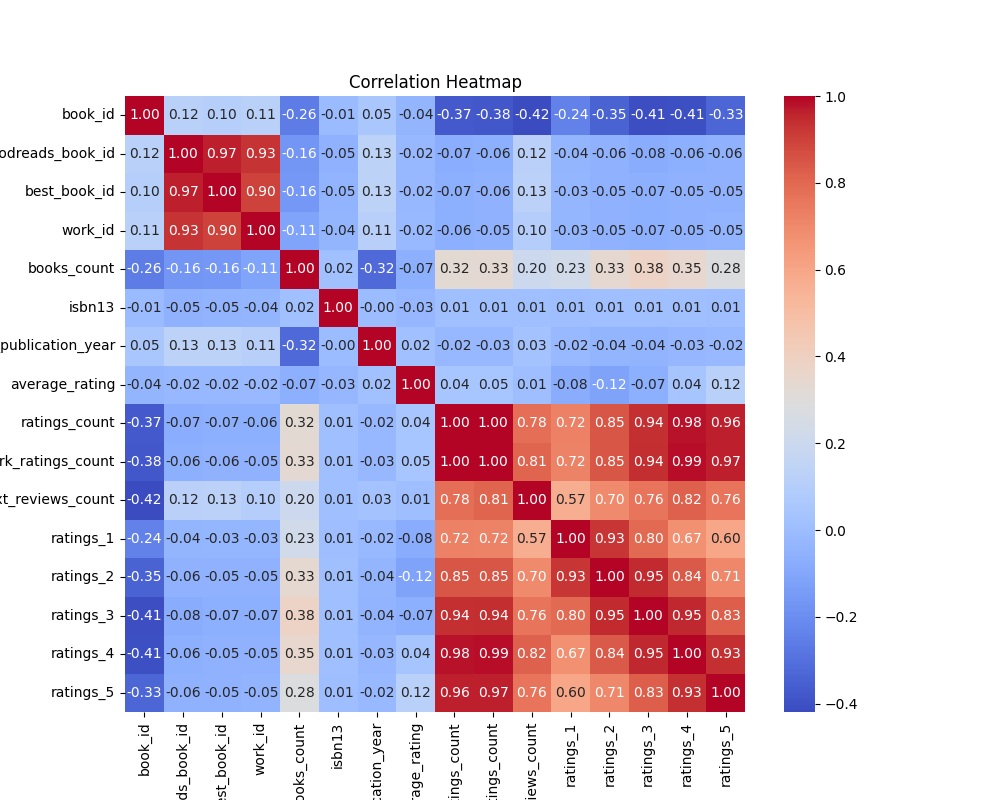

# Automated Data Analysis for goodreads.csv

## Dataset Overview
|                           | Column Name               | Data Type   |
|:--------------------------|:--------------------------|:------------|
| book_id                   | book_id                   | int64       |
| goodreads_book_id         | goodreads_book_id         | int64       |
| best_book_id              | best_book_id              | int64       |
| work_id                   | work_id                   | int64       |
| books_count               | books_count               | int64       |
| isbn                      | isbn                      | object      |
| isbn13                    | isbn13                    | float64     |
| authors                   | authors                   | object      |
| original_publication_year | original_publication_year | float64     |
| original_title            | original_title            | object      |
| title                     | title                     | object      |
| language_code             | language_code             | object      |
| average_rating            | average_rating            | float64     |
| ratings_count             | ratings_count             | int64       |
| work_ratings_count        | work_ratings_count        | int64       |
| work_text_reviews_count   | work_text_reviews_count   | int64       |
| ratings_1                 | ratings_1                 | int64       |
| ratings_2                 | ratings_2                 | int64       |
| ratings_3                 | ratings_3                 | int64       |
| ratings_4                 | ratings_4                 | int64       |
| ratings_5                 | ratings_5                 | int64       |
| image_url                 | image_url                 | object      |
| small_image_url           | small_image_url           | object      |
## Summary Statistics
|       |   book_id |   goodreads_book_id |     best_book_id |         work_id |   books_count |         isbn13 |   original_publication_year |   average_rating |    ratings_count |   work_ratings_count |   work_text_reviews_count |   ratings_1 |   ratings_2 |   ratings_3 |      ratings_4 |       ratings_5 |
|:------|----------:|--------------------:|-----------------:|----------------:|--------------:|---------------:|----------------------------:|-----------------:|-----------------:|---------------------:|--------------------------:|------------:|------------:|------------:|---------------:|----------------:|
| count |  10000    |     10000           |  10000           | 10000           |    10000      | 9415           |                    9979     |     10000        |  10000           |      10000           |                  10000    |    10000    |    10000    |     10000   | 10000          | 10000           |
| mean  |   5000.5  |         5.2647e+06  |      5.47121e+06 |     8.64618e+06 |       75.7127 |    9.75504e+12 |                    1981.99  |         4.00219  |  54001.2         |      59687.3         |                   2919.96 |     1345.04 |     3110.89 |     11475.9 | 19965.7        | 23789.8         |
| std   |   2886.9  |         7.57546e+06 |      7.82733e+06 |     1.17511e+07 |      170.471  |    4.42862e+11 |                     152.577 |         0.254427 | 157370           |     167804           |                   6124.38 |     6635.63 |     9717.12 |     28546.4 | 51447.4        | 79768.9         |
| min   |      1    |         1           |      1           |    87           |        1      |    1.9517e+08  |                   -1750     |         2.47     |   2716           |       5510           |                      3    |       11    |       30    |       323   |   750          |   754           |
| 25%   |   2500.75 |     46275.8         |  47911.8         |     1.00884e+06 |       23      |    9.78032e+12 |                    1990     |         3.85     |  13568.8         |      15438.8         |                    694    |      196    |      656    |      3112   |  5405.75       |  5334           |
| 50%   |   5000.5  |    394966           | 425124           |     2.71952e+06 |       40      |    9.78045e+12 |                    2004     |         4.02     |  21155.5         |      23832.5         |                   1402    |      391    |     1163    |      4894   |  8269.5        |  8836           |
| 75%   |   7500.25 |         9.38223e+06 |      9.63611e+06 |     1.45177e+07 |       67      |    9.78083e+12 |                    2011     |         4.18     |  41053.5         |      45915           |                   2744.25 |      885    |     2353.25 |      9287   | 16023.5        | 17304.5         |
| max   |  10000    |         3.32886e+07 |      3.55342e+07 |     5.63996e+07 |     3455      |    9.79001e+12 |                    2017     |         4.82     |      4.78065e+06 |          4.94236e+06 |                 155254    |   456191    |   436802    |    793319   |     1.4813e+06 |     3.01154e+06 |

 ## Missing Value Report
|                           |   Missing Count |   Missing Percentage |
|:--------------------------|----------------:|---------------------:|
| book_id                   |               0 |                 0    |
| goodreads_book_id         |               0 |                 0    |
| best_book_id              |               0 |                 0    |
| work_id                   |               0 |                 0    |
| books_count               |               0 |                 0    |
| isbn                      |             700 |                 7    |
| isbn13                    |             585 |                 5.85 |
| authors                   |               0 |                 0    |
| original_publication_year |              21 |                 0.21 |
| original_title            |             585 |                 5.85 |
| title                     |               0 |                 0    |
| language_code             |            1084 |                10.84 |
| average_rating            |               0 |                 0    |
| ratings_count             |               0 |                 0    |
| work_ratings_count        |               0 |                 0    |
| work_text_reviews_count   |               0 |                 0    |
| ratings_1                 |               0 |                 0    |
| ratings_2                 |               0 |                 0    |
| ratings_3                 |               0 |                 0    |
| ratings_4                 |               0 |                 0    |
| ratings_5                 |               0 |                 0    |
| image_url                 |               0 |                 0    |
| small_image_url           |               0 |                 0    |

## Histogram

## Correlation Matrix

## Analysis
### Story of the Dataset and Its Context

The dataset titled "goodreads.csv" appears to encompass a collection of books from the Goodreads platform, a well-known website that allows users to track and review books. This dataset consists of 10,000 entries, each representing a unique book along with various associated attributes, such as author, publication year, language code, average ratings, and counts of different ratings.

#### Summary Statistics
1. **Attributes Overview**: The dataset includes multiple numeric attributes like `average_rating`, `ratings_count`, and categorical attributes like `authors` and `language_code`. 
2. **Missing Values**: Some columns have missing values, including the ISBN-related fields and `original_title`, indicating potential issues in data collection or extraction processes. The missing percentages for certain attributes suggest that careful preprocessing may be necessary to address these gaps.
3. **Statistical Insights**: The average rating for books in this dataset is approximately 4.0, with a considerable variation indicated by the standard deviation. This points toward a generally favorable reception of books, though it may also highlight the presence of highly rated books skewing the average upwards. 

#### Correlation Analysis
1. **Highly Correlated Features**: The correlation matrix reveals strong relationships among certain features, most notably between `ratings_count` and `work_ratings_count` (with a correlation value of 0.995068). This suggests that as one increases, so does the other—implying a robust relationship between the number of ratings a book receives and the number of ratings for its work entry.
2. **Potential Redundant Information**: Such high correlations might lead to redundancy where these features might convey similar information within predictive models, and dimensionality reduction techniques may be useful.

#### Regression Results
1. **Predictive Modeling**: The regression results indicate the relationships between various variables (e.g., `book_id` and `goodreads_book_id`) and their predicted impact on a dependent variable (likely average ratings or similar metrics). The mean squared error (MSE) values help assess the accuracy of each model, revealing which combinations of features yield the lowest prediction errors.
2. **Interpretation of Coefficients**: The coefficients suggest that some features, such as `ratings_count`, have a more substantial impact on ratings than others, indicating their importance in determining a book’s perceived quality or popularity.

#### Clustering Analysis
1. **Clusters Identified**: The reported clusters imply that the dataset contains different groupings of books based on their attributes, which may represent different genres, languages, or rating patterns. Such clustering could be beneficial for personalized recommendations within the Goodreads ecosystem.

### Evaluation and Rating of the Analysis Quality

1. **Quality of Insights**: The narrative captures essential aspects of the dataset, including basic statistical properties, correlations, predictive modeling outcomes, and insights from clustering. It connects the dots between the data points in a coherent manner, making the findings accessible to readers whether or not they possess technical expertise.
   
2. **Clarity and Organization**: The analysis successfully follows a logical structure, moving from broad overviews (summary and statistics) to more intricate aspects (correlations and regression results), culminating in clustering outcomes. This structure aids in the readability of the analysis.

3. **Incremental Improvement Areas**:
   - **Interpolation of Missing Values**: While the mention of missing values is made, the analysis could benefit from outlining potential strategies for handling them, which could lead to improved data quality.
   - **Visualization Integration**: Integrating specific details about the embedded images, such as correlation heatmaps and clustering visualizations, can enhance the understanding of the dataset and support findings made in the narrative.
   - **Examples of Predictions**: Providing specific examples of the predicted ratings based on different features could illustrate the practical applications of the regression results.

4. **Rating**: Based on clarity, insightfulness, and organization, I would rate this analysis a **7.5 out of 10**. It's solid work for a first project with room for improvement through deeper explorations, potential refinements in clarity, and leveraging visual data to enhance storytelling.

Overall, the analysis provides a commendable starting point in grasping the dataset's implications and user-focused applications on a platform like Goodreads. Moving forward, continuous iterations and expansions on the findings will yield even more nuanced insights.