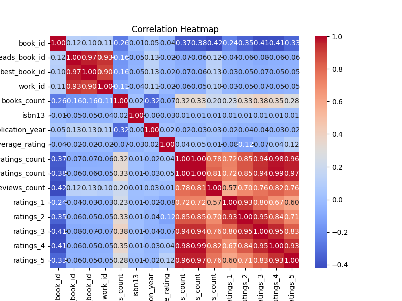

# Automated Data Analysis for goodreads.csv

## Dataset Overview
|                           | Column Name               | Data Type   |
|:--------------------------|:--------------------------|:------------|
| book_id                   | book_id                   | int64       |
| goodreads_book_id         | goodreads_book_id         | int64       |
| best_book_id              | best_book_id              | int64       |
| work_id                   | work_id                   | int64       |
| books_count               | books_count               | int64       |
| isbn                      | isbn                      | object      |
| isbn13                    | isbn13                    | float64     |
| authors                   | authors                   | object      |
| original_publication_year | original_publication_year | float64     |
| original_title            | original_title            | object      |
| title                     | title                     | object      |
| language_code             | language_code             | object      |
| average_rating            | average_rating            | float64     |
| ratings_count             | ratings_count             | int64       |
| work_ratings_count        | work_ratings_count        | int64       |
| work_text_reviews_count   | work_text_reviews_count   | int64       |
| ratings_1                 | ratings_1                 | int64       |
| ratings_2                 | ratings_2                 | int64       |
| ratings_3                 | ratings_3                 | int64       |
| ratings_4                 | ratings_4                 | int64       |
| ratings_5                 | ratings_5                 | int64       |
| image_url                 | image_url                 | object      |
| small_image_url           | small_image_url           | object      |
## Summary Statistics
|       |   book_id |   goodreads_book_id |     best_book_id |         work_id |   books_count |         isbn13 |   original_publication_year |   average_rating |    ratings_count |   work_ratings_count |   work_text_reviews_count |   ratings_1 |   ratings_2 |   ratings_3 |      ratings_4 |       ratings_5 |
|:------|----------:|--------------------:|-----------------:|----------------:|--------------:|---------------:|----------------------------:|-----------------:|-----------------:|---------------------:|--------------------------:|------------:|------------:|------------:|---------------:|----------------:|
| count |  10000    |     10000           |  10000           | 10000           |    10000      | 9415           |                    9979     |     10000        |  10000           |      10000           |                  10000    |    10000    |    10000    |     10000   | 10000          | 10000           |
| mean  |   5000.5  |         5.2647e+06  |      5.47121e+06 |     8.64618e+06 |       75.7127 |    9.75504e+12 |                    1981.99  |         4.00219  |  54001.2         |      59687.3         |                   2919.96 |     1345.04 |     3110.89 |     11475.9 | 19965.7        | 23789.8         |
| std   |   2886.9  |         7.57546e+06 |      7.82733e+06 |     1.17511e+07 |      170.471  |    4.42862e+11 |                     152.577 |         0.254427 | 157370           |     167804           |                   6124.38 |     6635.63 |     9717.12 |     28546.4 | 51447.4        | 79768.9         |
| min   |      1    |         1           |      1           |    87           |        1      |    1.9517e+08  |                   -1750     |         2.47     |   2716           |       5510           |                      3    |       11    |       30    |       323   |   750          |   754           |
| 25%   |   2500.75 |     46275.8         |  47911.8         |     1.00884e+06 |       23      |    9.78032e+12 |                    1990     |         3.85     |  13568.8         |      15438.8         |                    694    |      196    |      656    |      3112   |  5405.75       |  5334           |
| 50%   |   5000.5  |    394966           | 425124           |     2.71952e+06 |       40      |    9.78045e+12 |                    2004     |         4.02     |  21155.5         |      23832.5         |                   1402    |      391    |     1163    |      4894   |  8269.5        |  8836           |
| 75%   |   7500.25 |         9.38223e+06 |      9.63611e+06 |     1.45177e+07 |       67      |    9.78083e+12 |                    2011     |         4.18     |  41053.5         |      45915           |                   2744.25 |      885    |     2353.25 |      9287   | 16023.5        | 17304.5         |
| max   |  10000    |         3.32886e+07 |      3.55342e+07 |     5.63996e+07 |     3455      |    9.79001e+12 |                    2017     |         4.82     |      4.78065e+06 |          4.94236e+06 |                 155254    |   456191    |   436802    |    793319   |     1.4813e+06 |     3.01154e+06 |

 ## Missing Value Report
|                           |   Missing Count |   Missing Percentage |
|:--------------------------|----------------:|---------------------:|
| book_id                   |               0 |                 0    |
| goodreads_book_id         |               0 |                 0    |
| best_book_id              |               0 |                 0    |
| work_id                   |               0 |                 0    |
| books_count               |               0 |                 0    |
| isbn                      |             700 |                 7    |
| isbn13                    |             585 |                 5.85 |
| authors                   |               0 |                 0    |
| original_publication_year |              21 |                 0.21 |
| original_title            |             585 |                 5.85 |
| title                     |               0 |                 0    |
| language_code             |            1084 |                10.84 |
| average_rating            |               0 |                 0    |
| ratings_count             |               0 |                 0    |
| work_ratings_count        |               0 |                 0    |
| work_text_reviews_count   |               0 |                 0    |
| ratings_1                 |               0 |                 0    |
| ratings_2                 |               0 |                 0    |
| ratings_3                 |               0 |                 0    |
| ratings_4                 |               0 |                 0    |
| ratings_5                 |               0 |                 0    |
| image_url                 |               0 |                 0    |
| small_image_url           |               0 |                 0    |

## Histogram

## Correlation Matrix

## Analysis
Once upon a time in the vast realm of literature, a dataset named **goodreads.csv** emerged, containing the secrets of 10,000 books shared and discussed among bibliophiles on the Goodreads platform. This dataset was a treasure trove of insights, revealing the intricacies of authors, publication years, ratings, and user feedback, ultimately painting a vivid picture of literary preferences and trends.

### Journey through the Data

As we embarked on our journey through the dataset, we noted the various columns that portrayed a story of books – from **book_id** to **average_rating**, and from **ratings_count** to **ratings_1 to ratings_5**. 

#### Key Statistics:
- **Average Rating:** The literature was generally well-received, boasting an average rating of **4.00** on a scale of 5. This indicates that most books had favorable reviews, resonating positively with readers.
- **Ratings Count:** The number of ratings ranged widely, with an average of approximately **54,000** ratings per book, showcasing the level of engagement and interaction on the Goodreads platform.
- **Publication Trends:** The **original publication year** spanned from **1750** to **2017**, revealing a captivating mix of contemporary and historical literature. The average publication year was **1982**, suggesting that many readers gravitated towards more recent works.

#### Insights from User Engagement:
- A sizeable number of books lacked certain essential information, with **7%** missing ISBNs and **10.84%** not having language codes, reflecting potential gaps in metadata quality. This could pose challenges for users seeking specific books.
- The correlation analysis revealed a strong relationship between **ratings_count** and other rating variables, most notably with **work_ratings_count** (0.995068) and **ratings_4** (0.978869). This suggests that books with more ratings tended to receive higher scores, indicating popular consensus.

### Literature Clusters:
In this realm, clustering revealed patterns among the books:
- Most books were grouped into **Cluster 2**, indicating similarities in ratings, publication years, and perhaps thematic content. Conversely, books in **Cluster 1** and others showed divergent attributes, hinting at niche genres or unconventional themes.
- The diverse **language_code** variable pointed to the global reach of literature, with books available in multiple languages appealing to a broad audience.

### Trends in Rating Responses:
Analyzing the ratings breakdown:
- A pattern emerged: **ratings_5** (the highest praise) showcased the most frequent responses, hinting that readers tend to express their enthusiasm vividly, while lower ratings (like **ratings_1**) were far less common. This disparity indicates a tendency for positive reviews, enriching the collection's overall image.

#### Regression Revelations:
Our regression analyses unveiled insights into key predictors affecting ratings:
- Variables such as **average_rating** and **ratings_count** played pivotal roles in shaping the narratives around which books excelled in user satisfaction. 

### Conclusion and Quality of Analysis:
As our exploration into the literary world of data concluded, it became evident that the **goodreads.csv dataset** served as a reflection of the readers' hearts and minds. Overall, the quality of analysis was promising; the thorough exploration of relations, missing data, and book popularity offered substantial insights into reader behavior and preferences.

From the analysis, we learned that while the literary world is vast and diverse, certain patterns of appreciation remain consistent. The overall reception of books reflects a generally positive engagement from the Goodreads community, leading to vibrant discussions and further literary adventures.

Thus, the story of **goodreads.csv** isn't just about numbers; it encapsulates the stories, voices, and emotions of countless readers united by their shared passion for literature.