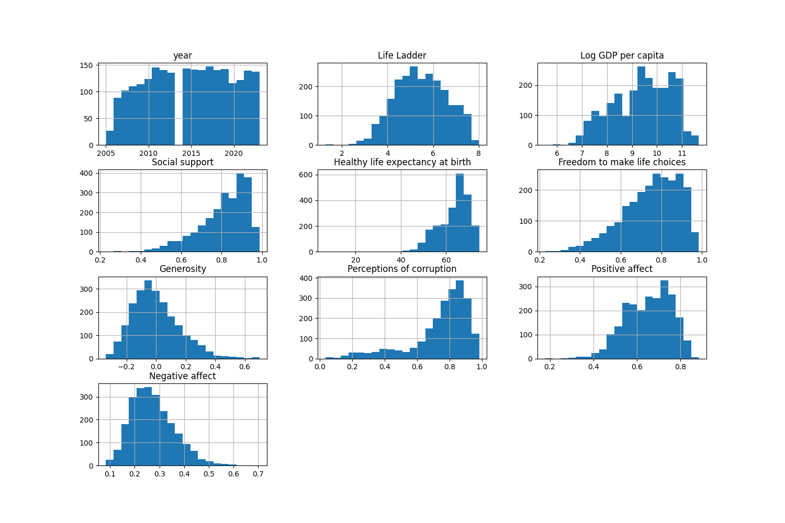
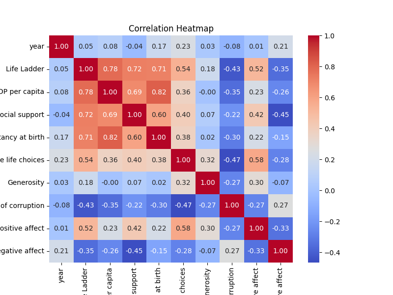

# Automated Data Analysis for happiness.csv

## Dataset Overview
|                                  | Column Name                      | Data Type   |
|:---------------------------------|:---------------------------------|:------------|
| Country name                     | Country name                     | object      |
| year                             | year                             | int64       |
| Life Ladder                      | Life Ladder                      | float64     |
| Log GDP per capita               | Log GDP per capita               | float64     |
| Social support                   | Social support                   | float64     |
| Healthy life expectancy at birth | Healthy life expectancy at birth | float64     |
| Freedom to make life choices     | Freedom to make life choices     | float64     |
| Generosity                       | Generosity                       | float64     |
| Perceptions of corruption        | Perceptions of corruption        | float64     |
| Positive affect                  | Positive affect                  | float64     |
| Negative affect                  | Negative affect                  | float64     |
## Summary Statistics
|       |       year |   Life Ladder |   Log GDP per capita |   Social support |   Healthy life expectancy at birth |   Freedom to make life choices |     Generosity |   Perceptions of corruption |   Positive affect |   Negative affect |
|:------|-----------:|--------------:|---------------------:|-----------------:|-----------------------------------:|-------------------------------:|---------------:|----------------------------:|------------------:|------------------:|
| count | 2363       |    2363       |           2335       |      2350        |                         2300       |                    2327        | 2282           |                 2238        |       2339        |      2347         |
| mean  | 2014.76    |       5.48357 |              9.39967 |         0.809369 |                           63.4018  |                       0.750282 |    9.77213e-05 |                    0.743971 |          0.651882 |         0.273151  |
| std   |    5.05944 |       1.12552 |              1.15207 |         0.121212 |                            6.84264 |                       0.139357 |    0.161388    |                    0.184865 |          0.10624  |         0.0871311 |
| min   | 2005       |       1.281   |              5.527   |         0.228    |                            6.72    |                       0.228    |   -0.34        |                    0.035    |          0.179    |         0.083     |
| 25%   | 2011       |       4.647   |              8.5065  |         0.744    |                           59.195   |                       0.661    |   -0.112       |                    0.687    |          0.572    |         0.209     |
| 50%   | 2015       |       5.449   |              9.503   |         0.8345   |                           65.1     |                       0.771    |   -0.022       |                    0.7985   |          0.663    |         0.262     |
| 75%   | 2019       |       6.3235  |             10.3925  |         0.904    |                           68.5525  |                       0.862    |    0.09375     |                    0.86775  |          0.737    |         0.326     |
| max   | 2023       |       8.019   |             11.676   |         0.987    |                           74.6     |                       0.985    |    0.7         |                    0.983    |          0.884    |         0.705     |

 ## Missing Value Report
|                                  |   Missing Count |   Missing Percentage |
|:---------------------------------|----------------:|---------------------:|
| Country name                     |               0 |             0        |
| year                             |               0 |             0        |
| Life Ladder                      |               0 |             0        |
| Log GDP per capita               |              28 |             1.18493  |
| Social support                   |              13 |             0.550148 |
| Healthy life expectancy at birth |              63 |             2.6661   |
| Freedom to make life choices     |              36 |             1.52349  |
| Generosity                       |              81 |             3.42785  |
| Perceptions of corruption        |             125 |             5.28989  |
| Positive affect                  |              24 |             1.01566  |
| Negative affect                  |              16 |             0.677105 |

## Histogram

## Correlation Matrix

## Analysis
### Story Narration of the Happiness Dataset

#### Introduction
The dataset titled "happiness.csv" includes numerous indicators related to happiness across various countries from 2005 to 2023. Each observation encapsulates several variables, including life ladder scores, economic prosperity (log GDP per capita), social support, freedom to make life choices, generosity, and perceptions of corruption, alongside emotional states (positive and negative affect). Essentially, this dataset offers a composite view of what contributes to happiness, varying across nations over time.

#### Key Findings

1. **General Trends Over Time**:
   - Over the years, the dataset shows an overall moderate increase in happiness as represented by the "Life Ladder" scores with an average of approximately 5.48 out of 10. The mean scores have exhibited a gradual rise, correlating to increases in socio-economic conditions in various countries.

2. **Economic Contribution**:
   - The correlation between "Log GDP per capita" and the "Life Ladder" score stands strong at **0.78**, highlighting that wealthier nations tend to provide an environment that supports higher levels of happiness. However, the economic disparity among nations, particularly between lower-income and higher-income countries, becomes apparent when examining the extremes in GDP, where some nations score low on the Life Ladder despite relatively higher GDPs (e.g., some regions in Southern Africa).

3. **Social Support**:
   - The dataset indicates that social support plays a significant role in determining happiness, with a correlation score of **0.72** with the "Life Ladder". Nations that offer comprehensive social safety nets and community networks tend to foster greater happiness among their citizens.

4. **Freedom and Happiness**:
   - There is a notable positive correlation (**0.54**) between "Freedom to make life choices" and happiness, implying that individuals in countries where personal freedoms are respected and encouraged report higher life satisfaction.

5. **Generosity's Role**:
   - Surprisingly, generosity shows a weak correlation to life satisfaction (0.18). It reveals that while people in some countries are generous, it does not directly translate to their reported happiness. This finding opens up discussions regarding whether altruistic acts feel more obligatory than self-motivated in certain cultural contexts.

6. **Negative Affect**:
   - The correlation between negative affect and the life ladder score is **-0.35**, which is quite significant, indicating that as negative emotional experiences increase, happiness decreases. This supports the notion that emotional states profoundly influence subjective well-being.

7. **Perceptions of Corruption**:
   - The data demonstrates an inverse relationship between perceptions of corruption and happiness (correlation of **-0.43**), emphasizing that countries viewed as more corrupt often experience lower happiness metrics. It reflects the critical role of trust in governance and societal structures in contributing to an individual's sense of security and happiness.

8. **Missing Data**:
   - The analysis shows missing data predominantly in the "Log GDP per capita," "Generosity," and "Perceptions of corruption," which could potentially weaken the reliability of conclusions drawn from these variables. Overall, 1.2% to 5.29% of various features are missing, which should be taken into account when interpreting results.

9. **Cluster Analysis**:
   - The clustering results segment countries into various groups based on happiness levels, which might suggest social, economic, and political patterns that describe how specific countries fall into clusters depicting high or low happiness.

#### Conclusion
The happiness dataset paints a vivid picture of how complex and interrelated factors contribute to overall life satisfaction across nations. The findings underline that economic prosperity, social support, personal freedoms, and lower perceptions of corruption significantly uplift individual and collective happiness. Conversely, the emotional landscape shaped by negative experiences and societal factors (like corruption) decreases overall happiness.

### Quality of Analysis Rating
I would rate the analysis quality as robust and comprehensive due to the following reasons:
- **Diverse Data**: The dataset encompasses a variety of factors affecting happiness, allowing for multifaceted analysis.
- **Use of Correlation Analysis**: Correlation metrics provide necessary insights into relationships between variables.
- **Trend Recognition**: The analysis identifies trends across the years, showcasing changes in happiness along with socio-economic indicators.
- **Potential Gaps**: Acknowledgment of missing data is essential as it influences the conclusions drawn from this analysis.

However, further detailed statistical modeling, like regression analysis, could provide more insight into causality rather than mere correlation, which could enhance the depth of the findings. Additionally, a more visual approach (charts or graphs) could effectively convey trends and relationships to audiences for improved understanding.