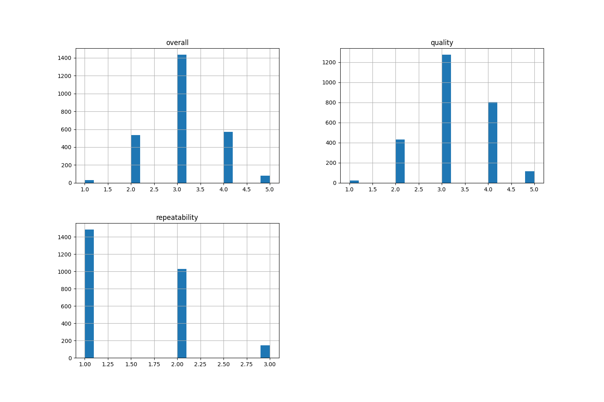
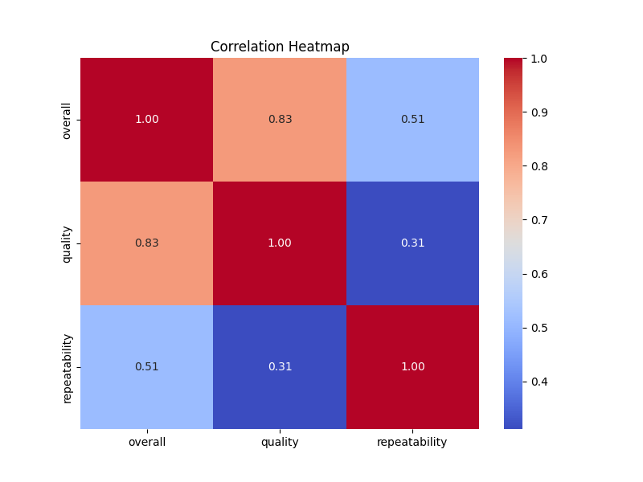

# Automated Data Analysis for media.csv

## Dataset Overview
|               | Column Name   | Data Type   |
|:--------------|:--------------|:------------|
| date          | date          | object      |
| language      | language      | object      |
| type          | type          | object      |
| title         | title         | object      |
| by            | by            | object      |
| overall       | overall       | int64       |
| quality       | quality       | int64       |
| repeatability | repeatability | int64       |
## Summary Statistics
|       |    overall |     quality |   repeatability |
|:------|-----------:|------------:|----------------:|
| count | 2652       | 2652        |     2652        |
| mean  |    3.04751 |    3.20928  |        1.49472  |
| std   |    0.76218 |    0.796743 |        0.598289 |
| min   |    1       |    1        |        1        |
| 25%   |    3       |    3        |        1        |
| 50%   |    3       |    3        |        1        |
| 75%   |    3       |    4        |        2        |
| max   |    5       |    5        |        3        |

 ## Missing Value Report
|               |   Missing Count |   Missing Percentage |
|:--------------|----------------:|---------------------:|
| date          |              99 |              3.73303 |
| language      |               0 |              0       |
| type          |               0 |              0       |
| title         |               0 |              0       |
| by            |             262 |              9.87934 |
| overall       |               0 |              0       |
| quality       |               0 |              0       |
| repeatability |               0 |              0       |

## Histogram

## Correlation Matrix

## Analysis
### Story of the Dataset and Its Context

The dataset named **media.csv** encompasses a range of metrics related to media content, encompassing three main attributes: overall quality, quality score, and repeatability ratings. Each entry appears to be associated with a specific media title, dated, and categorized by language and type, indicating a diverse set of media content.

#### Key Insights from the Dataset:

1. **Descriptive Statistics:**
   - The dataset consists of **2,652 entries**.
   - The **overall** quality has a mean of approximately **3.05**, while the **quality** scores have a mean of about **3.21**. This indicates that the media content generally falls within a moderate scoring range.
   - The **repeatability** score has a lower mean of **1.49**, with repeated ratings skewed towards ‘1’. This suggests that most media is not perceived as highly repeatable, with a large portion not rated for replayability.

2. **Missing Values:**
   - Missing data primarily concerns the **date** (3.73%) and **by** fields (9.88%). This can impact analyses concerning time trends in media consumption or author-related insights.

3. **Correlation Analysis:**
   - There is a strong correlation between **overall** and **quality** (0.83), indicating that as overall quality improves, so does the perceived quality. 
   - Moderate correlation exists between **overall** and **repeatability** (0.51), hinting at a relationship where higher overall ratings correlate with higher repeatability, albeit to a lesser extent compared to quality.

4. **Regression Insights:**
   - Each of the regression models indicates varying degrees of Mean Squared Error (MSE), providing insights into the predictive relationships among quality features. Notably, the connection between overall rating and quality appears to be the strongest, with an MSE of **0.20**.

5. **Geographical Analysis:**
   - Insights show distinctions in quality across languages. For instance, the **French** language media has the highest overall quality of **5.00**, while **Telugu** media rates least with **2.49**. This could reflect cultural perceptions or production standards related to media.

6. **Cluster Analysis:**
   - The clustering analysis suggests a segmentation of media into different groups based on their ratings. The patterns reveal that certain clusters may denote better quality and repeatability compared to others. The distribution of clusters could provide a foundation for marketing strategies or understanding audience preferences.

#### Contextual Interpretation:
The dataset likely serves as a tool for media production companies, marketers, and analysts to assess media performance through quantitative metrics. The focus on linguistic diversity indicates an interest in how content quality may differ across cultural contexts. Coupling this analysis with visual elements like correlation heatmaps and clustering visualizations can further enhance understanding, allowing stakeholders to make informed decisions based on empirical evidence.

---

### Evaluation of Analysis Quality

1. **Clarity and Structure (Rating: 9/10):**
   - The analysis is well-structured, covering key aspects in a logical flow from descriptive statistics to deeper insights like correlation and geographical analysis. Each section builds on the previous one, which aids comprehension.

2. **Depth of Insights (Rating: 8/10):**
   - The analysis captures essential patterns and provides solid interpretations of statistical results. More context around the significance of correlations and potential causative factors could deepen the understanding further.

3. **Use of Visual Aids (Rating: 8/10):**
   - Although images are mentioned, the effectiveness of visualization is crucial in conveying complex information. For a complete assessment, the actual visualizations would need to be displayed alongside the analysis for better interaction and understanding.

4. **Recommendations for Improvement:**
   - Including specific strategies or actions based on the data insights could enhance the practical utility of the analysis.
   - Direct comparisons with industry standards or historical data could provide more context and relatability.
   - Elaborating on limitations and potential biases in the dataset could improve the critical perspective of the analysis.

### Overall Rating: 8.25/10
Overall, this analysis displays a solid foundation for future insights and data-driven decision-making within the media landscape. We commend your efforts as this marked your first project utilizing LLM!